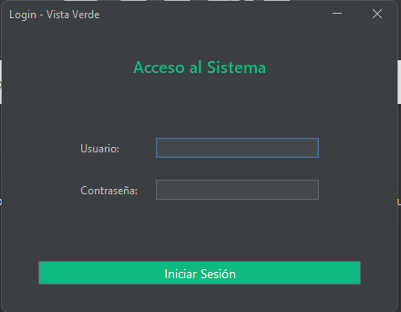
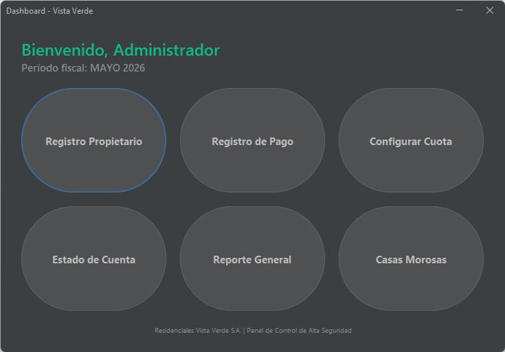
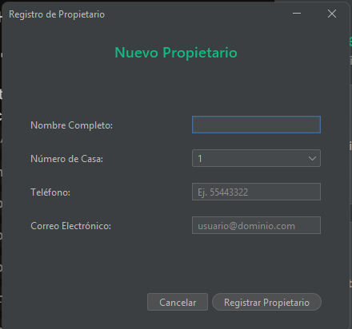
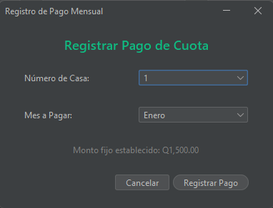
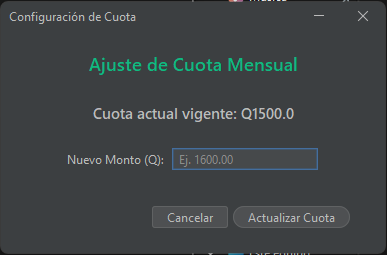
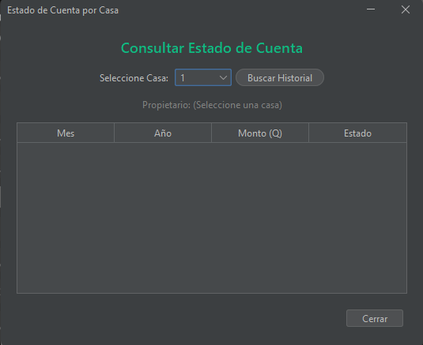
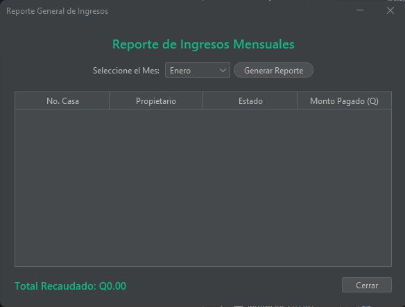
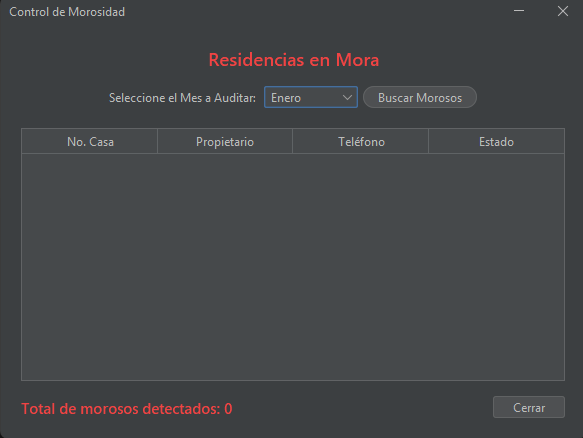
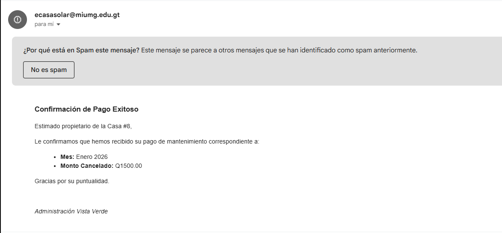

# 🏡 Sistema de Administración de Condominio "Vista Verde"


## 📖 Descripción del Proyecto
El **Sistema de Administración de Condominio Vista Verde** es una aplicación de escritorio desarrollada en Java para el curso de Programación I. Está diseñada para permitir al administrador gestionar de manera eficiente el cobro y control de cuotas de mantenimiento de las **30 casas** que conforman el complejo residencial. 

Este proyecto integra desarrollo de software con Java Swing, versionamiento de código con GitHub, y cumple con los requerimientos de persistencia de datos y notificaciones automáticas.

## ✨ Características Principales y Reglas de Negocio

* 🔒 **Seguridad y Accesos (Pantalla 1):** Autenticación exclusiva para el administrador con credenciales predefinidas y validación de seguridad (límite de 3 intentos).
* 🏘️ **Control de Residencias (Pantalla 3):** Administración de las 30 casas (numeradas del 1 al 30). El sistema aplica la restricción estricta de un solo propietario por casa, evitando registros duplicados.
* 💰 **Gestión Financiera (Pantallas 4 y 5):** * Configuración dinámica de la cuota global de mantenimiento (Base: Q1,500.00 mensuales).
  * Registro de pagos con **validación cronológica**: no se permiten pagos duplicados del mismo mes ni pagos a futuro sin haber cancelado los meses anteriores. No se manejan pagos parciales.
* 📊 **Módulo de Reportes y Auditoría (Pantallas 6, 7 y 8):**
  * Estado de cuenta individual por casa (meses pagados, pendientes y total).
  * Generación de tabla general (JTable) de ingresos, comparando lo recaudado vs el total esperado (Q45,000.00 base).
  * Vista de auditoría de **Casas Morosas** del mes actual para facilitar el contacto.
* 📧 **Notificaciones Automáticas (Puntos Extra):** Integración con API de JavaMail para el envío automático de comprobantes de pago digitales al correo del propietario.
* 💾 **Persistencia de Datos (Puntos Extra):** Almacenamiento local mediante serialización (`.dat`) para garantizar que la información no se pierda al cerrar el programa.

## 📸 Vistas del Sistema (Pantallas)
A continuación se presentan las vistas operativas requeridas para el funcionamiento del sistema:

1. **Login del Administrador:**
   

2. **Inicio (Menú Principal):**
   

3. **Registro de Propietario:**
   

4. **Registro de Pago de Cuota:**
   

5. **Configuración de Cuota:**
   

6. **Estado de Cuenta por Casa:**
   

7. **Reporte General:**
   

8. **Casas Morosas:**
   

9. **Comprobante de Pago (Funcionalidad Extra):**
   

## 🏗️ Arquitectura y Tecnologías

El proyecto fue construido respetando el patrón de diseño **MVC (Modelo-Vista-Controlador)** para separar la lógica de negocio de la interfaz gráfica.

* **Lenguaje:** Java (JDK 17 o superior).
* **Interfaz Gráfica:** Java Swing.
* **Look and Feel (Puntos Extra):** Framework FlatLaf para un diseño minimalista y moderno.
* **Gestor de Dependencias:** Apache Maven (`pom.xml`).

### 📂 Estructura de Directorios
```text
📦 ProyectoGestionVistaVerde
 ┣ 📂 src/main/java/
 ┃ ┣ 📂 com.mycompany.proyectogestionvistaverde (Clase Main)
 ┃ ┣ 📂 logic (Controladores, validaciones, correo y GestorDatos)
 ┃ ┣ 📂 model (Clases base: Casa, Propietario, Condominio, Pago)
 ┃ ┗ 📂 ui (Interfaces gráficas Swing)
 ┣ 📂 docs/
 ┃ ┣ 📂 diagramas (Diagrama de Clases UML)
 ┃ ┣ 📂 manual (Manual de Usuario PDF)
 ┃ ┗ 📂 Pantallas (Capturas del sistema)
 ┗ 📜 pom.xml

## 🚀 Instalación y Ejecución

1. **Clonar el repositorio:**
   ```bash
   git clone [https://github.com/danieelde7/CondominioVistaVerde.git](https://github.com/danieelde7/CondominioVistaVerde.git)
Abrir en el IDE:
Abre la carpeta del proyecto utilizando Apache NetBeans, IntelliJ IDEA o Eclipse.

Cargar Dependencias:
Asegúrate de que Maven descargue las dependencias de FlatLaf y JavaMail desde el archivo pom.xml.

Ejecutar:
Corre el archivo principal ProyectoGestionVistaVerde.java para levantar la pantalla de Login. Usa las credenciales asignadas en el código para ingresar.

👥 Equipo de Desarrollo y Gestión Ágil
Este proyecto fue planificado y ejecutado utilizando metodologías ágiles a través de tableros Kanban.

🔗 CLIC AQUÍ PARA VER EL TABLERO DE JIRA DEL EQUIPO

Integrantes del Equipo:

[Daniel Eduardo Quintanilla Alonzo] - Carné: [0900-25-14144] - Rol: Scrum Master y Configuración Base

Edgar Aroldo Casasola Rodas - Carné: [0900-25-15758] - Rol: Arquitectura de Modelo de Datos

[Emily Jazmin Alvarez Hernández] - Carné: [0900-25-28925] - Rol: Desarrollo de Interfaz Gráfica (UI)

[Bryan Alexander Alvarez Marroquín] - Carné: [0900-25-29596] - Rol: Desarrollo de Reportes y Auditoría

[Luis Rodolfo Porras García] - Carné: [0900-25-6111] - Rol: Lógica de Negocio y Persistencia Backend

Universidad Mariano Gálvez de Guatemala (UMG) - Facultad de Ingeniería en Sistemas de Información
Curso: Programación I | Catedrático: César Alejandro Juárez López